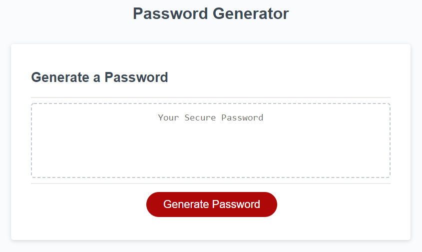

# Password Generator Starter Code
Weekly Challenge 03

## Challenge Approach
In my GitHub Repo, I created several issues for myself that resemble the acceptance criteria. I will allow them to guide me through this challenge.

I will create feature branches along the way to document how i completed each issue.
* Note: I may put more than one issue into one branch

## Challenge Details

### User Story
AS AN employee with access to sensitive data
I WANT to randomly generate a password that meets certain criteria
SO THAT I can create a strong password that provides greater security

### Acceptance Criteria
GIVEN I need a new, secure password
WHEN I click the button to generate a password
THEN I am presented with a series of prompts for password criteria
WHEN prompted for password criteria
THEN I select which criteria to include in the password
WHEN prompted for the length of the password
THEN I choose a length of at least 8 characters and no more than 128 characters
WHEN prompted for character types to include in the password
THEN I choose lowercase, uppercase, numeric, and/or special characters
WHEN I answer each prompt
THEN my input should be validated and at least one character type should be selected
WHEN all prompts are answered
THEN a password is generated that matches the selected criteria
WHEN the password is generated
THEN the password is either displayed in an alert or written to the page

### Mockup
Here is the mockup for this website

